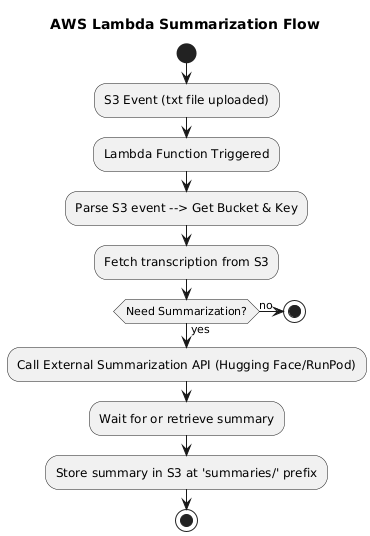

1. Project Overview
A Company frequently generates large audio transcriptions that need automatic summarization. This project provides an AWS Lambda solution that:

Listens for (.txt) uploads to an S3 bucket.

Fetches the text from S3.

Calls an external AI endpoint (Hugging Face / RunPod) to generate a 4,000-word summary.

Stores the resulting summary in S3, under a specified prefix.

This repository demonstrates local testing with moto (mock S3) and unittest.mock (mock external API calls). It also includes a discussion about which large-language model is appropriate for summarizing long transcriptions (~10,000+ words).

2. Model

For long-form summarization (~10,000 words) with ~4,000-word outputs, we need a model that can handle 32k+ token contexts. Two strong contenders are:

MPT-30B (by MosaicML)

Context window: up to 65k tokens.

VRAM usage: Quite large; an A100 or H100 GPU is recommended.

Pros: Excellent for long-context summarization.

Cons: Heavy model (~30B parameters) and might require quantization for smaller GPUs.

Longformer (AllenAI)

Context window: Up to 32k tokens.

Designed for long documents with an efficient attention mechanism.

Pros: Good performance on summarization tasks, well-documented.

Cons: Slightly less generative than MPT-30B for creative or complex tasks.

We chose MPT-30B to handle very large transcripts, given its 65k-token context. However, if GPU resources are more constrained or if a smaller model suffices, Longformer or a smaller variant of MPT could be used.

3. Architecture and Workflow

Explanation:
*S3 Event: A .txt file is uploaded → AWS Lambda is triggered.

*Lambda: Reads the file from S3 → sends the text to external summarization API.

*API: Summarizes text (~4,000 words).

*Lambda: Receives summary → writes a new .txt to summaries/<original>.txt_summary.

*End: Summaries now stored in S3.

4. Main Components

1 lambda_function.py

#get_text_from_s3(bucket, key): Downloads the transcription text from S3.

#submit_runpod_job(text): (Originally for RunPod) but now calls Hugging Face Inference API.

#put_text_to_s3(bucket, key, text): Saves the summarized text back to S3.

2 test_lambda.py

#Uses moto to mock S3.

#Uses unittest.mock to patch requests.post calls.

#Ensures no real external calls or real AWS usage are made in local tests.

3 requirements.txt

Lists dependencies (boto3, requests, pytest, moto, etc.) for local development/testing.

7. Setup & Deployment

Prerequisites:

AWS Account, S3 Bucket, IAM Role for Lambda with S3 read/write permissions.

Steps:
1 Clone/Download this repository.

2 Install dependencies (for local dev/testing):

bash
Copy
Edit
#pip install -r requirements.txt
3 Configure AWS (locally) if you want to do real integration tests, or rely on the AWS Lambda environment if you’re deploying.

4 Deploy the Lambda (manually or using frameworks like AWS SAM / Serverless Framework):

*In the AWS console, create a Lambda function (Python 3.x).

*Upload/zip lambda_function.py.

*Set Environment Variables:

*HF_API_TOKEN = <your-hf-access-token>

*Adjust memory/timeout settings as needed.

5 Set an S3 Event Notification on your target bucket to trigger the Lambda on ObjectCreated events for .txt files.

6 Test by uploading a .txt file to S3.

After the Lambda finishes, your summary should appear under summaries/<filename>_summary.txt (or your chosen prefix).